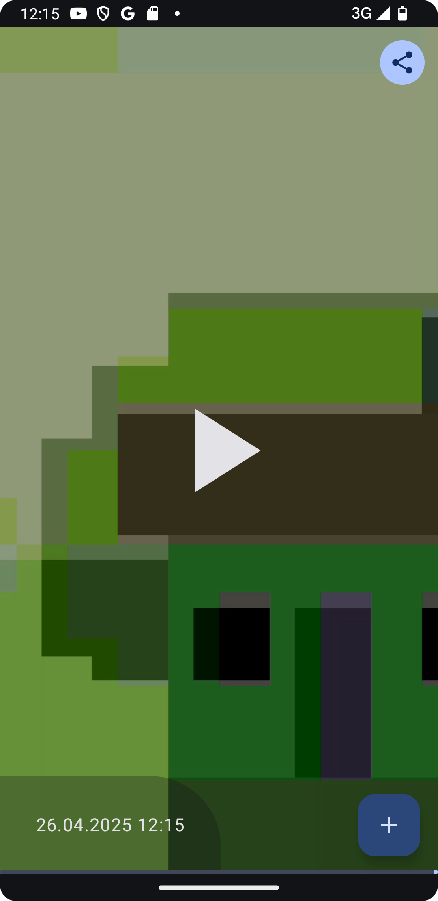
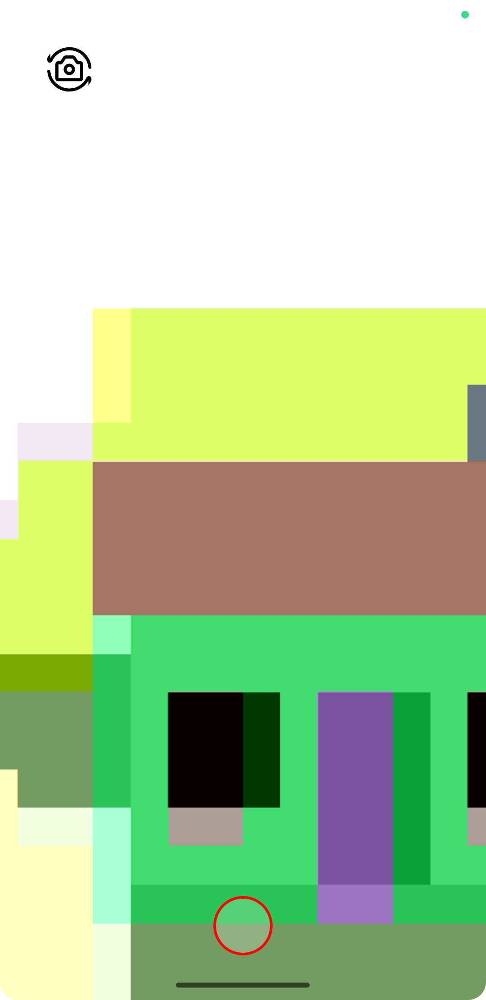
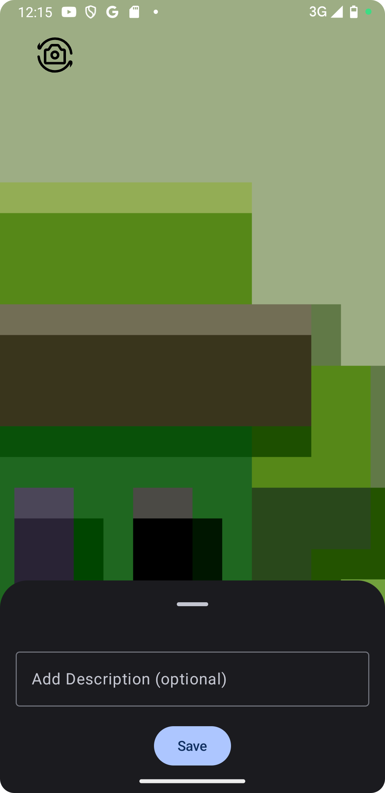
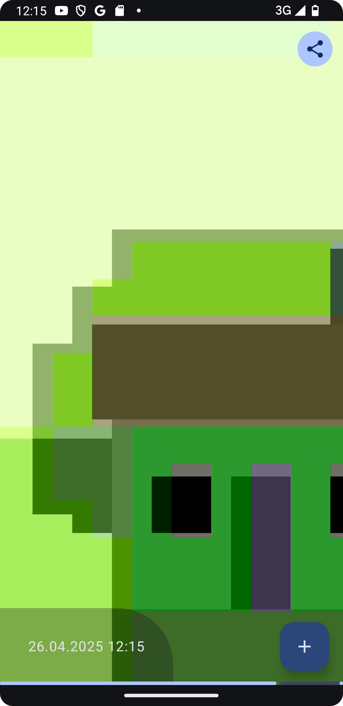
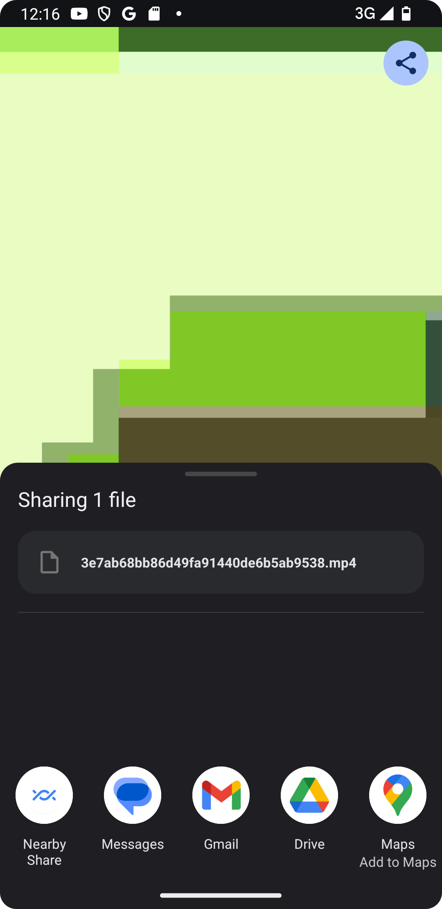

    
    <h1>Mini Video Journal App</h1>
    
An Android application for recording videos and check them out

---

  
  
  

  
  
  

## Features
- Record a short video using the device camera (front/back)
- Save the video locally with description and thumbnail (SQLDelight)
- Display a feed of recorded clips (latest first) with full-screen vertical snapping
- Tapping a video plays it inline
- Handle camera permission
- Share video
- Github actions Unit Tests runs on Pull Request created

## TODO
- Add GitHub Actions to create pull requests, automatically run tests and build release app
- Add screenshot tests with Compose previews (add to github actions)
- Add firebase crashlytics for production flavor
- Migrate from AndroidView Camera Preview to proper Compose
- Migrate from AndroidView Media3 video Preview to proper Compose

## NOTES
- Android Studio Version: Android Studio Meerkat | 2024.3.1 Patch 1
- Minimum SDK: 28
- Target SDK: 35